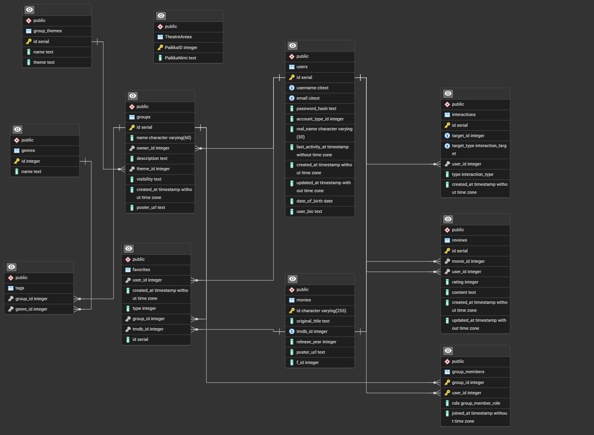

# Movietok Backend Server

Modern Node.js backend for the Movietok movie platform with comprehensive review system, user groups, favorites management, and integration with Finnkino and TMDB APIs.

##  Features

- **User Management**: Registration, authentication, profiles and JWT authentication
- **Review System**: Movie reviews, likes/dislikes, aura scoring system
- **Group Features**: User groups, member management, group favorites
- **Favorites List**: Personal favorites with three levels (1-3)
- **API Integrations**: Finnkino API and TMDB (The Movie Database) API
- **Modern Features**: JWT authentication, CORS support, health checks
- **Database**: PostgreSQL database with complete schema

## 📁 Project Structure

```
backend/
├── src/
│   ├── config/                  # Database and other configurations
│   │   ├── database.js
│   │   └── config.js
│   ├── controllers/             # API controllers (CRUD logic)
│   │   ├── UserController.js
│   │   ├── ReviewController.js
│   │   ├── GroupController.js
│   │   ├── FavoritesController.js
│   │   ├── FinnkinoController.js
│   │   ├── TMDBController.js
│   │   └── GenresController.js
│   ├── middleware/              # Express middlewares
│   │   └── auth.js
│   ├── models/                  # Database models
│   │   ├── User.js
│   │   ├── Movie.js
│   │   ├── Reviews.js
│   │   ├── Group.js
│   │   └── Genre.js
│   ├── routes/                  # API routes
│   │   ├── index.js
│   │   ├── userRoutes.js
│   │   ├── reviewRoutes.js
│   │   ├── groupRoutes.js
│   │   ├── favorites.js
│   │   ├── finnkinoRoutes.js
│   │   └── tmdbRoutes.js
│   ├── services/                # Business logic
│   │   ├── UserService.js
│   │   ├── ReviewService.js
│   │   └── FinnkinoService.js
│   └── utils/                   # Utility functions
├── scripts/                     # Helper scripts
│   └── switch-env.js
├── tests/                       # Tests
│   ├── user.test.js
│   ├── auth.test.js
│   └── review.test.js
├── index.js                     # Application entry point
├── package.json                 # Dependencies & scripts
├── Database.sql                 # Database schema
├── Postman/                     # Postman schemas for endpoint testing
├── FINNKINO_API.md              # Finnkino API documentation
└── README.md                    # This documentation
```

##  Requirements

- Node.js 18+ 
- PostgreSQL 14+
- npm or yarn

##  Installation

1. Clone the repository
``bash
git clone [repository-url]
cd backend
``

2. Install dependencies
``bash
npm install
``

3. Create database and run schema
``bash
# Create PostgreSQL database and run Database.sql script
psql -U postgres -d your_database < Database.sql
``

4. Create environment variables (.env file)

### Development Environment (.env)
``env
NODE_ENV=development
PORT=3000

# CORS Configuration
CORS_ORIGINS=http://localhost:3001,http://localhost:5173

# Development Database
DEV_DB_HOST=localhost
DEV_DB_PORT=5432
DEV_DB_NAME=moviedb_dev
DEV_DB_USER=postgres
DEV_DB_PASSWORD=dev_password

# Development JWT Secret
DEV_JWT_SECRET=dev_jwt_secret_change_this

# Fallback values
DB_H
### Production Environment (.env.production)
``env
NODE_ENV=production
PORT=3000

# CORS Configuration (your domains)
CORS_ORIGINS=https://yourdomain.com,https://www.yourdomain.com

# Production Database
PROD_DB_HOST=your_production_db_host
PROD_DB_PORT=5432
PROD_DB_NAME=moviedb_prod
PROD_DB_USER=prod_user
PROD_DB_PASSWORD=very_secure_production_password

# Production JWT Secret (MUST be secure!)
PROD_JWT_SECRET=extremely_secure_production_jwt_secret
``

##  Scripts

### Basic Scripts
- 
pm run dev - Start server in development mode with nodemon
- 
pm run devStart - Start server in development mode with nodemon
- 
pm start - Start server in production mode
- 
pm test - Run tests
- 
pm run test:coverage - Run tests with coverage report
- 
pm run test:watch - Run tests in watch mode

### Environment-specific Commands
- 
pm run start:dev - Development server
- 
pm run test:server - Test server  
- 
pm run start:prod - Production server

### Database Connection Testing
- 
pm run db:connect:dev - Test development database connection
- 
pm run db:connect:test - Test test database connection
- 
pm run db:connect:prod - Test production database connection

### Database Setup
- 
pm run db:setup - Create development database
- 
pm run db:setup:test - Create test database

### Configuration Validation
- 
pm run config:validate - Check that configuration is correct

##  API Endpoints

###  Public Endpoints

#### Health Check
- GET /api/health - Health check including database connection

#### User Management
- POST /api/users/register - User registration
- POST /api/users/login - User login
- GET /api/users/:id - Get user profile by ID (includes aura stats)

#### Reviews (Public)
- GET /api/reviews/recent - Get recent reviews (includes movie info)
- GET /api/reviews/users-by-review-count - Get users by review count
- GET /api/reviews/users-by-aura - Get users by aura points
- GET /api/reviews/:id - Get single review
- GET /api/reviews/movie/:movieId - Get movie reviews
- GET /api/reviews/user/:userId - Get user reviews
- GET /api/reviews/group/:groupId - Get group reviews

#### Groups (Public)
- GET /api/groups/popular - Get most popular groups by member count
- GET /api/groups/search - Search groups
- GET /api/groups/by-genres - Get groups by genres
- GET /api/groups/themes - Get all group themes
- GET /api/groups/:id - Get group details

#### Finnkino API (No token required)
- GET /api/finnkino/events - Get movie list
- GET /api/finnkino/events/:id - Get single movie details
- GET /api/finnkino/schedule - Get movie schedules
- GET /api/finnkino/events/:id/schedule - Get movie schedule
- GET /api/finnkino/theatres - Get theater areas list
- GET /api/finnkino/search - Search movies
- GET /api/finnkino/popular - Get popular movies
- GET /api/finnkino/coming-soon - Get upcoming movies
- GET /api/finnkin
###  Protected Endpoints (require JWT token)

#### User Management
- GET /api/users/profile - Get own user profile (includes aura stats)
- PUT /api/users/profile - Update own user profile  
- DELETE /api/users/profile - Delete own account
- GET /api/users - Get all users (includes aura stats)
- PUT /api/users/:id - Update user by ID (admin)
- DELETE /api/users/:id - Delete user by ID (admin)

#### Reviews (Protected)
- POST /api/reviews - Create new review (includes movie info)
- PUT /api/reviews/:id - Update review (includes movie info)
- DELETE /api/reviews/:id - Delete review
- POST /api/reviews/:id/interaction - Add/remove like/dislike

#### Groups (Protected)
- GET /api/groups/user/:userId/groups - Get user's groups
- POST /api/groups - Create new group
- PUT /api/groups/:id - Update group details
- POST /api/groups/:id/join - Join group
- POST /api/groups/:id/request-join - Request to join group
- PUT /api/groups/:id/members/:userId/approve - Approve membership request
- GET /api/groups/:id/pending-requests - Get pending membership requests
- DELETE /api/groups/:id/leave - Leave group
- DELETE /api/groups/:id/members/:userId - Remove member from group
- PUT /api/groups/:id/members/:userId/role - Update member role
- DELETE /api/groups/:id - Delete group

#### Favorites
- GET /api/favorites - Get user's favorites
- POST /api/favorites - Add movie to favorites
- DELETE /api/favorites/:id - Remove favorite
- GET /api/favorites/user/:userId - Get user's favorites (admin)
- GET /api/favorites/group/:groupId - Get group favorites

##  Authentication

Include JWT token in Authorization header:
``
Authorization: Bearer <your_jwt_token>
``

Token contains user information and expires after a defined time period.

## 🗄️ Database Schema



*Entity Relationship Diagram of the Movietok Database*

The project uses PostgreSQL database with the following tables:

### Main Tables
- **users** - User information (includes user_bio field)
- **movies** - Movie information (TMDB integration)
- **reviews** - User reviews (1-5 stars + comment)
- **groups** - User groups by themes
- **favorites** - User favorite movies (3 levels)

### Junction Tables
- **group_members** - Group memberships and roles
- **group_themes** - Group themes/topics
- **tags** - Group genre tags
- **interactions** - Review likes/dislikes

### Features
- **Aura Points**: Calculated based on review likes received
- **Group Hierarchy**: Owner, moderator, member roles
- **Favorite Levels**: 1 = watched, 2 = liked, 3 = group favorite

##  Testing

The project includes comprehensive tests with Mocha and Chai:

``bash
# Run all tests
npm test

# Run tests with coverage report
npm run test:coverage

# Run tests in watch mode
npm run test:watch
``

##  Development

Start development server:

``bash
npm run dev
# or
npm run devStart
``

Server starts on the port defined in .env file (default: 3000).

##  Architecture

The project follows MVC (Model-View-Controller) pattern:

- **Models** (src/models/): Database model definitions and CRUD operations
- **Controllers** (src/controllers/): HTTP request handling and response formatting
- **Services** (src/services/): Business logic and data processing
- **Routes** (src/routes/): API route definitions and authentication
- **Middleware** (src/middleware/): Authentication, validation and error handling
- **Config** (src/config/): Application configurations and database connection

### API Versioning
The project supports API versioning:
- /api/v1/* - Versioned API
- /api/* - Legacy API (backward compatibility)

##  Extensibility

The project is designed to be easily extensible:

1. **New Models**: Create new file in src/models/ folder
2. **New Controllers**: Create new file in src/controllers/ folder
3. **New Services**: Create new file in src/services/ folder
4. **New Routes**: Create new file in src/routes/ folder and add it to src/routes/index.js

### Feature Suggestions
- Reporting system (reports table ready)
- Moderation system (bans table ready)
- User-to-user messaging
- Movie recommendation algorithms
- API call caching system

##  Statistics

The backend provides comprehensive statistics:
- **User Statistics**: Review count, average rating, aura points
- **Group Statistics**: Member count, activity, most popular groups  
- **Review Statistics**: Recent, most popular, user-specific

##  Deployment

The project is ready for production deployment:
- Cross-platform support (cross-env)
- Environment-specific configurations
- Health check for CI/CD
- PostgreSQL optimized
- **Favorite Levels**: 1 = watched, 2 = liked, 3 = group favorite
o/now-showing - Get now showing movies

#### TMDB API
- GET /api/tmdb/* - TMDB API proxy endpoints
OST=localhost
DB_PORT=5432
DB_NAME=moviedb
DB_USER=postgres
DB_PASSWORD=password
JWT_SECRET=fallback_secret
``
